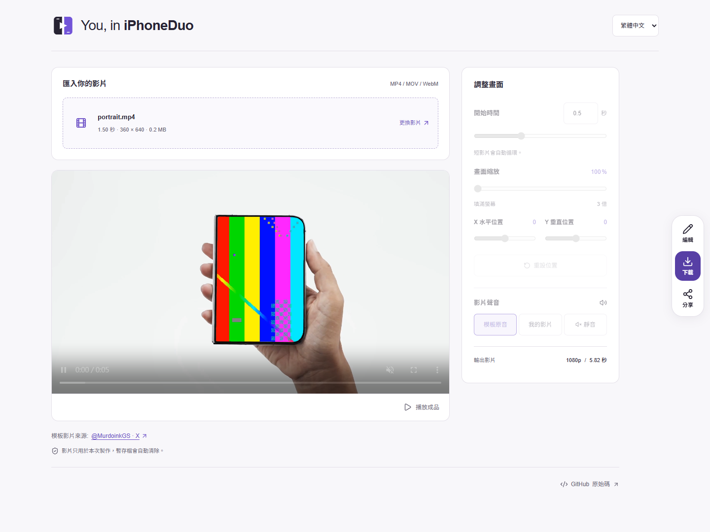

# You, in iPhoneDuo

將你的影片放進 iPhone Duo，製作專屬迷因。
Put your video inside iPhone Duo and make it a meme.



## 繁體中文

匯入 5 MB 以內的影片（不限秒數），即時預覽、調整構圖，再下載 MP4 分享到社群。支援摺疊效果、可拖曳的浮動預覽，以及繁體中文、簡體中文和英文介面。

使用 Modern.js、Rspack 與原生 FFmpeg，在自己的電腦上執行。

## English

Upload a video up to 5 MB, with no duration limit, preview and adjust the framing, then download an MP4 to share. Includes a fold effect, draggable floating preview, and Traditional Chinese, Simplified Chinese, and English interfaces.

Built with Modern.js, Rspack, and native FFmpeg. Runs on your own computer.

## 啟動 / Quick start

Node.js 22.13+

```sh
npm ci
npm run dev
```

開啟 / Open [localhost:3000](http://localhost:3000).

[開發與部署 / Development](docs/development.md) · [測試紀錄 / Verification](docs/verification.md)

影片來源 / Video source: [@MurdoinkGS on X](https://x.com/MurdoinkGS/status/2097794206525788302)

程式碼 / Code: [MIT](LICENSE)；不含第三方影片 / excludes third-party video.

摺疊效果改編自 / Fold effect adapted from [chuspeeism/iphone-duo](https://github.com/chuspeeism/iphone-duo/tree/2662ebbeb6aa844cd4f6888f7d6f8958662249fd) · MIT © 2026 jadon7。保留完整[授權聲明 / license notice](public/licenses/iphone-duo-MIT.txt)。原專案的 Apple 模型與圖片不屬於 MIT 授權，本專案未引入這些素材 / Apple models and images are outside that license and are not included here.
